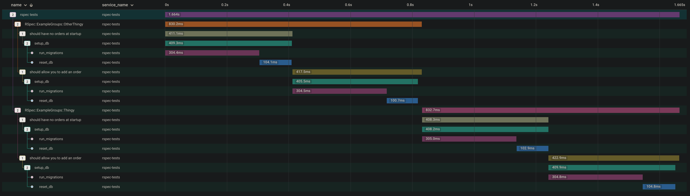

# RSpec Honeycomb instrumentation

This test suite sends all example groups and examples as spans to Honeycomb,
grouped under a common top-level root span.

It is not necessary to manually add spans to every example or example group, this is done automatically by the spec_helper.

Explicit spans should be added around the places inside tests, such as setup helpers. (See `spec/db.rb` for example).

## Example output

When you run the suite, you should get traces similar to the following:

